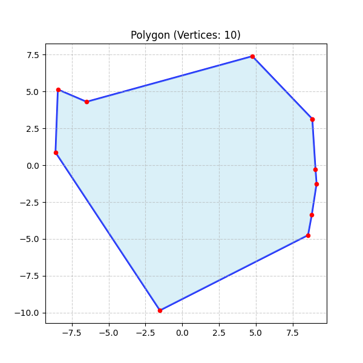
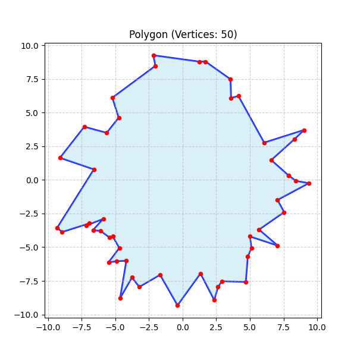
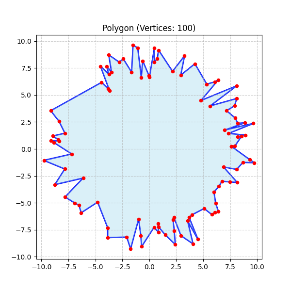
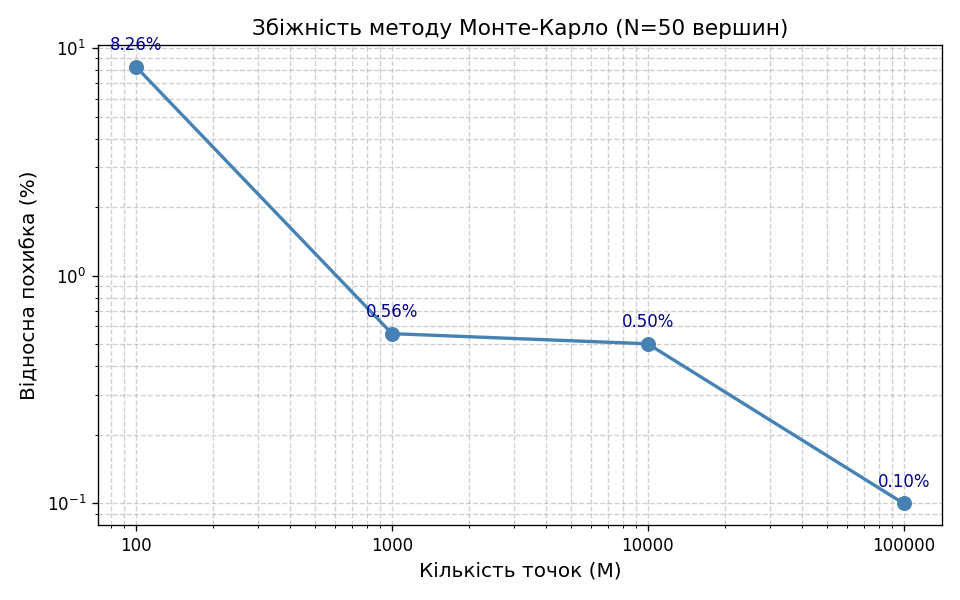
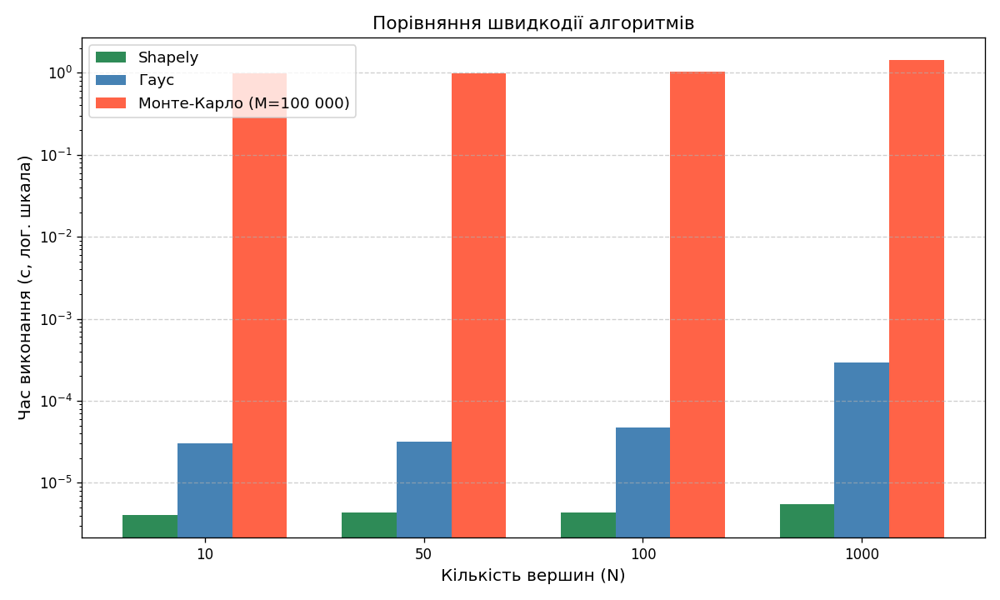

# Лабораторна робота №6: Алгоритмічні та евристичні методи обчислення площі геометричних фігур
# Деніел Мартін, ІПЗ-4.01

## Опис
У цій лабораторній роботі реалізовано та порівняно два методи обчислення площі полігонів:
* **Метод Гауса (Формула шнурків / Shoelace formula):** Точний аналітичний алгоритм, який обчислює площу простого багатокутника за відомими координатами його вершин. Площа визначається як половина абсолютної суми різниць добутків координат сусідніх вершин: `S = 0.5 * |Σ (x_i * y_{i+1} - x_{i+1} * y_i)|`.
* **Метод Монте-Карло:** Наближений імовірнісний алгоритм. Генерує випадкові точки всередині Bounding Box полігону та обчислює площу як пропорцію точок-влучань до загальної кількості точок, помножену на площу BB.

Як еталонне значення для розрахунку похибок використовується оптимізована функція з бібліотеки Shapely (на базі GEOS C++).

---

## Структура проекту
```
lab-polygon-area/
├── src/
│   ├── main.py          # Основний скрипт запуску всіх експериментів
│   ├── generators.py    # Генерація та візуалізація полігонів
│   └── algorithms.py    # Реалізація методів (Гаус, Монте-Карло)
├── images/
│   ├── polygon_10.png
│   ├── polygon_50.png
│   ├── polygon_100.png
│   ├── error_plot.png
│   └── time_benchmark.png
├── requirements.txt
├── .gitignore
└── README.md
```

---

## Результати

### Приклади згенерованих полігонів
Генерація випадкових фігур різної складності (N — кількість вершин):

| N = 10 | N = 50 | N = 100 |
| :---: | :---: | :---: |
|  |  |  |

### Перевірка точності алгоритмів (N = 50)

| Метод | Площа | Похибка відносно Shapely |
| :--- | :--- | :--- |
| Shapely (еталон) | 196.705686 | — |
| Гаус | 196.705686 | 0.0000% |
| Монте-Карло (M = 100 000) | 196.509235 | 0.0999% |

Метод Гауса дає результат, **ідентичний** еталонному значенню Shapely з точністю до машинної похибки з рухомою комою.

### Графік збіжності методу Монте-Карло
Залежність відносної похибки від кількості згенерованих точок для полігону з 50 вершинами:



| Кількість точок (M) | Площа МК | Відносна похибка (%) |
| :--- | :--- | :--- |
| 100 | 180.4493 | 8.2643% |
| 1 000 | 197.8001 | 0.5564% |
| 10 000 | 195.7180 | 0.5021% |
| 100 000 | 196.5092 | 0.0999% |

### Порівняння швидкодії (Benchmark)
Вимірювання часу виконання алгоритмів (у секундах). Для методу Монте-Карло — M = 100 000 точок.



| Кількість вершин (N) | Shapely (с) | Гаус (с) | Монте-Карло (с) |
| :--- | :--- | :--- | :--- |
| 10 | 0.000004 | 0.000030 | 0.983198 |
| 50 | 0.000004 | 0.000032 | 0.989965 |
| 100 | 0.000004 | 0.000047 | 1.026242 |
| 1000 | 0.000005 | 0.000290 | 1.427685 |

---

## Висновки

### Порівняння точності методів (Гаус vs Монте-Карло)
Метод Гауса є **абсолютно точним** аналітичним алгоритмом — його результат практично збігається з еталонним значенням Shapely (похибка 0.0000%). Це закономірно, оскільки обидва методи базуються на тій самій математичній формулі і обмежені лише точністю представлення чисел з рухомою комою.

Метод Монте-Карло, натомість, є принципово наближеним. При M = 100 000 точок він дає похибку ~0.10%, що є прийнятним для більшості практичних задач, але принципово поступається Гаусу.

### Порівняння швидкості методів (Гаус vs Монте-Карло)
Метод Гауса продемонстрував надзвичайно високу швидкість завдяки лінійній обчислювальній складності O(N). Навіть для полігону з 1000 вершин він виконує розрахунок за ~0.00029 с (менше третини мілісекунди). Shapely є ще швидшим завдяки реалізації на C++.

Метод Монте-Карло виявився суттєво повільнішим — понад 1 секунду для будь-якого N. Це пов'язано з тим, що для кожної з 100 000 точок виконується ресурсомістка перевірка входження в полігон через `Polygon.contains()`. Складність фактично визначається M, а не N полігону.

### Аналіз точності Монте-Карло: скільки ітерацій достатньо?
Результати підтверджують Закон великих чисел — точність імовірнісного методу прямо залежить від кількості ітерацій:
* При **100 точках** похибка неприйнятна (~8.26%).
* При **1 000 точках** похибка вже знаходиться в межах ~0.56% — суттєве покращення.
* При **10 000 точках** похибка ~0.50% — незначне покращення відносно 1 000.
* При **100 000 точках** досягається похибка ~0.10%.

Для отримання *прийнятної* точності (похибка менше 1%) цілком достатньо **1 000–10 000 ітерацій**. Подальше збільшення до 100 000 дає скромне покращення (~5x більше обчислень заради 5x кращої точності), що виправдано лише у випадках, коли висока точність є критичною вимогою.
